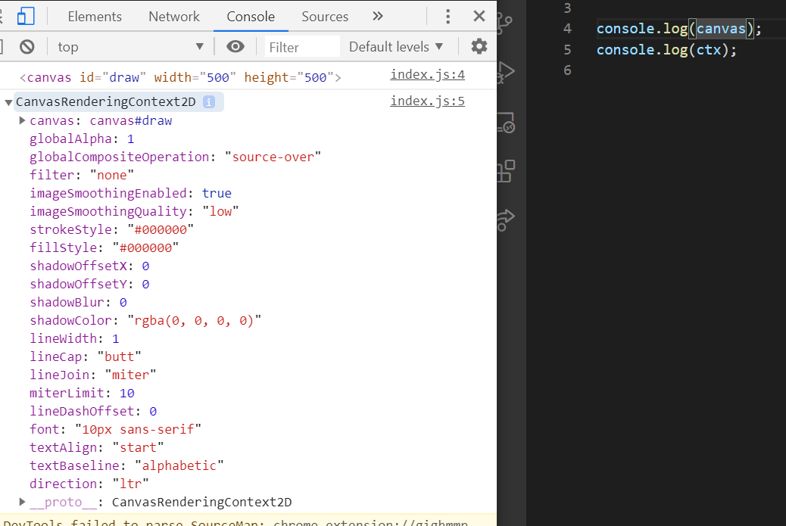

## JavaScript30 學習紀錄
跟著WES BOS一系列的影片，練習JavaSript，並記錄下來每篇學習到的內容

[WES BOS的GitHub](https://github.com/wesbos/JavaScript30)  
[JavaScript30官網](https://javascript30.com/)

## 01_JavaScript-Drum-Kit
#### 思考方向: 
1. 監聽鍵盤按下去的動作 `'keydown'` ，利用傳入的 keycode 來判斷是否有對應 data-key 的 audio，若有的話則取得對應的 div 和 audio
2. 使具有對應 data-key 的 audio 播放 `audio.play()` 與設置撥放時間 `audio.currentTime = 0`
3. 由於這邊我們希望再按下鍵盤的時候加上特效，所以將取得 div 的 class 加上 `playing` ，並在 CSS 加上樣式
4. 加上 `playing` ，就需要處理移除，否則會一直保持特效。所以先監聽所有 `.key` 具有 `transitionend` 事件時，移除 `playing` (這邊先判斷傳入的 propretyName 是否為 transform，若否則退出)

#### 筆記:
````
if (e.propertyName !== 'transform') {return}; //return可去除大括弧,寫成 if (e.propertyName !== 'transform') return


const key = document.querySelector(`.key[data-key="${e.keyCode}"]`); //其中.k其中也可寫div
````
1. `.classList` 後面可以加上 `.add()` 或 `.remove()` ，可對 `class` 屬性裡面的值進行新增或移除，另外還有 `.toggle()` 和 `.contains()` 等方法
2. `transitionend` 事件是伴隨著 `transition` 結束時觸發的，所以 CSS 裡面的 `.key` 需設置該屬性
3. `querySelectorAll(selectors)` 與 `querySelector(selectors)` 皆是取得符合的元素，但前者是回傳 `NodeList` (類似Array的集合)，後者則是回傳第一個符合的元素

## 02_CSS + JS Clock
#### 思考方向: 
1. 製作時鐘的秒針、分針、時針
2. 使用 `let now = new Date()` 得當前時區的時間，搭配 `getSeconds()` 、 `getMinutes()` 、 `getHours()` 個別取得秒、分、時。再計算轉換成角度，替秒/分/時針的 style 屬性 `transform` 添值
#### 筆記:
1. `transform-origin` 屬性可以設定元素變化的原點(旋轉基礎點的位置)
2. `transition-timing-function` 可設定動畫的速度曲線，亦可將值寫在 `transition` 內
3. 由於 `transition` 有設定延遲 0.05秒，所以會造成秒針走到0秒時會有很明顯反彈，可以再寫判斷式，當角度為 90度 時，將 `transition` 的延遲設為0。或是若不在意延遲秒數的視覺感的話，就暫不設計這個部分
4. `setInterval(setDate, 1000)` 表示 每1000毫秒 觸動 `setDate` 函式; 與 `setTimeout()` 不同之處在於前者會不斷觸發函式，而後者則是單次觸發

## 03_Playing-with-CSS-Variables-and-JS
#### 思考方向:
1. 先利用 CSS 原生的變數設定各個初始值
2. 抓到 inputs 的集合，用 `forEach` 監聽鼠標指針在指定的元素中移動和改變的事件，去更動 CSS 的變數中的值
#### 筆記:
1. CSS 選取器: `:root` 是一種 `pseudo-class` ，基本上與 `<html>` 相同，但前者的優先權高於後者
2. CSS 內宣告變數用法: `--custom-property-name` (前面加兩個破折號)
3. CSS 呼叫變數: `var( <custom-property-name> , <declaration-value> )` ，若前者無效，則會使用 `declaration-value` 
4. `filter` 是CSS內的濾鏡效果， `blur` 是其中一種用來控制元素模糊程度的特效
5. `addEventListene` 可監聽 HTML DOM 的事件 [可參考MDN](https://developer.mozilla.org/zh-TW/docs/Web/Events)
6. JavaSript 可以用 `dataset` 取得 DOM 裡設置的自定義資料屬性 `data-*`

## 04_Array-Cardio-Day1
#### 思考方向:
這一篇作者用八個題目來示範取得 Array 內資料的方法。
第一至五題 
陣列 inventors 是一個包著數個 Object 的 Array，練習以下語法
1. `Array.prototype.filter()`
2. `Array.prototype.map()`
3. `Array.prototype.sort()`
4. `Array.prototype.reduce()`
5. `Array.prototype.sort()` 將數字型態的值搭配簡單運算，再進行排序
第六題
綜合數個概念至維基取得所要的資料，練習以下語法
1. 將 `nodeList` 轉成 `Array`
2. `.includes()` (請見第五篇的筆記)
3. `Array.prototype.filter()`
4. `Array.prototype.map()`
第七題
`Array.prototype.sort()` 搭配 `split()` 將字串型態的值切開，再進行排序
第八題
`Array.prototype.reduce()` 也利用起始值設計成空的物件 `{} (Object)`，再做判斷決定物件內容
#### 筆記:
1. `console.table` 可將數據以表格形式顯示在瀏覽器的控制台，還有其他選項，在第9篇有更詳細的介紹 [MDN](https://developer.mozilla.org/en-US/docs/Web/API/Console)
2. `arrow function expression` [(箭頭函式)](https://developer.mozilla.org/zh-TW/docs/Web/JavaScript/Reference/Functions/Arrow_functions) 可以簡化 `function expression` 的語法
````
//// function expression 

function name([param[, param[, ... param]]]) {
  statements
  return expression
}

//// arrow function expression

(param1 = defaultValue1, param2, ...rest) => { statements } 
(param1, param2, …, paramN) => expression
// equivalent to: => { return expression; }

// Parentheses are optional when there's only one parameter name:
(singleParam) => { statements }
singleParam => { statements }

// The parameter list for a function with no parameters should be written with a pair of parentheses.
() => { statements }
````
`function expression` 裡面要搭配 `return` 否則會回傳 `undefined` [參考](https://developer.mozilla.org/zh-TW/docs/Web/JavaScript/Reference/Statements/return)

3. 許多語言具有類似的表達方法， 這一篇作者示範的方法，在 Ruby 裡也有類似的功能， 三元運算子的表達方式也很像
4. 本篇的題目六，可再回顧第一篇的筆記第三點 `querySelectorAll(selectors)` 回傳 `NodeList` 而非 `Array` ，但可使用 `Array.from()` 或是用 `[]` 在內加上前綴 `[...]` (spread syntax 擴展語法) 將其轉換成 `Array` 
5. JavaSript 裡 `...` 有兩種， 除了上述的 `spread syntax` 另一種則是 `rest parameters`，像是第二點內有寫到的 `...rest` 就是其一範例
6. 最後一題讓我想到之前寫 Ruby 時練習的一題，概念有點類似，可以一起搭配著 [參考](https://medium.com/@lanya4190/03-94b12155fdd)

## 05_Flex-Panels-Image-Gallery
#### 思考方向:
這篇著重在CSS排版的部分， JavaSript 的思考方向與第一篇 (JavaScript-Drum-Kit) 較雷同

1. 先用 CSS 將版面排出
2. 利用 JavaSript 的 `.classList.toggle()` 技巧，對 `class` 屬性裡面的值 `open` 及 `open-active` 進行: 開關切換 (新增&刪除，像是電燈按鈕一樣) 的功能
3. 針對 `open` 及 `open-active` 想要的特效也寫在 CSS 裡面
4. 抓到 `.panel` 的集合，用 `forEach` 監聽鼠標指針在指定的元素中 `click` 和 `transitionend` 進行步驟2. `.classList.toggle()` 的效果
5. 步驟4. 中 `transitionend` 可下一個判斷式， 用 `e.propertyName` 抓到觸發 `transitionend` 的屬性名稱，若含有 `flex` 的話，則
#### 筆記:
1. 作者有提到瀏覽器的差異，所以判斷式中是使用 `.includes('flex')` 而非 `===` ， `.includes()` 前面可以判斷字串內的是否含有某字詞，會得到 `true` 或 `false`

````
  Safari transitionend event.propertyName === flex
  Chrome + FireFox transitionend event.propertyName === flex-grow
````

## 06_Ajax-Type-Ahead
#### 思考方向:
1. 用 `fetch` 發送請求， 再使用 `json()` 去讀取跟解析 `json` 資料，用 `then` 連結 [參考](https://developer.mozilla.org/zh-TW/docs/Web/JavaScript/Reference/Global_Objects/Promise)。
2. 監聽 `input` 的 `change` 事件和 `keyup` 事件，進行 `displayMatches` 函式處理字串比對，建立了一個 `RegExp` 用於 `match` 來進行字串比對 (將此抽出獨立寫成 `findMatches` 函式)，將比對結果用 `map` 來 `return` (返回) 寫進去 HTML 中。

#### 筆記:
1. 不同於第一篇的監聽的 `keydown`，此篇是監聽 `keyup` ，會在手指離開按鍵時觸發，試著將此篇範例換成 `keydown` 卻是不合適的，會在打下一個字母時，才出現上一個字母的比對結果。 又想著既然是監聽 `keyup` ，那是否不監聽 `change` 也可有相同效果? 於是嘗試了一下是可行的。 但若反之，會與 `keydown` 出現相同的結果
2. 第五篇也有使用到的 偽類選取器 `:nth-child(an + b)` 裡面的 `an + b` 除了可以按順序選取 `an + b項` 之外，也可以輸入關鍵字 `even(偶數) 也可寫成 2n` 或 `odd(奇數) 也可寫成 2n + 1` 
3. 除了 `json` 之外，也有其他種解析種類， 像是: `text()` ，可 [參考](https://developer.mozilla.org/en-US/docs/Web/API/Body)

## 07_Array-Cardio-Day2
#### 思考方向及筆記:
1. Array.prototype.some() 練習
題目: 確認陣列 people 中是否有19歲以上的人?
用第二篇練習過的 `new Date()` ，先取得當前時區的時間，再用 `getFullYear()` 取得四位數的年份，取得後與陣列中的年份相減
並用 `some()` 進行判斷，回傳布林值
2. Array.prototype.every() 練習
題目: 確認陣列 people 中是否所有人都19歲以上?
與上題類似，差別在於用 `every()` 進行判斷，只要有一筆不符合即回傳 `false`
3. Array.prototype.find() 練習
題目: 找出陣列 comments 之中 id 為 823423 的第一筆資料
與 `Array.prototype.filter()` 類似，差別是 `find()` 僅回傳符合條件的第一筆資料
4. `Array.prototype.findIndex()` 搭配 `Array.prototype.splice()` 及 練習
題目: 找出陣列 comments 之中 id 為 823423 的資料索引值, 並透過索引值刪除這筆資料
有兩種刪除這筆資料(或是取得不含該筆資料)的方式:

(1) `Array.prototype.splice()` 
`splice()` 可以用來刪除或加入陣列中的元素，改變原始陣列
[參考](https://developer.mozilla.org/zh-TW/docs/Web/JavaScript/Reference/Global_Objects/Array/splice)
 
(2) `spread syntax`  搭配 `Array.prototype.slice()`
`slice()` 可以回傳一個新陣列物件，而原本的陣列不會被改變，利用這個語法取得這筆以外的前後資料，再用 `spread syntax` 來展開陣列
[參考](https://developer.mozilla.org/en-US/docs/Web/JavaScript/Reference/Operators/Spread_syntax)

## 08_Fun-with-HTML5-Canvas
#### 步驟:
1. 在 HTML 建立一個 `<canvas>` 區塊
2. 利用 JavaSript `document.querySelector` 取得該物件
3. 該物件可使用 `.getContext('2d')` 取得渲染環境 [參考 MDN](https://developer.mozilla.org/zh-TW/docs/Web/API/Canvas_API/Tutorial/Basic_usage)
4. `ctx` 可試著在瀏覽器的控制台印出來，可看到有許多值可以定義，或者也可以從 [MDN](https://developer.mozilla.org/en-US/docs/Web/API/CanvasRenderingContext2D) 找到相關資訊

5. 監聽 `canvas` 的滑鼠事件
(1) `mousemove` 滑鼠移動時，執行函式 `draw`，函式內第一行即判斷 `isDrawing` 定是否執行該函式
(2) `mousedown` 當滑鼠按下時，並將目前的滑鼠位置，設定成繪畫時的起始位置， `isDrawing` 設成 `true`
(3) `mouseup` 滑鼠放開時， `isDrawing` 設成 `false`
(4) `mouseout` 滑鼠離開 `canvas` 元素時， `isDrawing` 設成 `false` ，可是如果想要移開後回來有畫圖連續性感覺時，這個事件可看需求性決定是否需要
6.  函式 `draw` 內開始設定繪畫的相關值，一樣可從步驟 4 的連結找到相關資訊
7. 這個範例額外做了兩個按鈕來決定開始繪畫和清空畫布的效果，清空畫布可使用 `.clearRect(x, y, width, height)` 來設定起始座標和範圍內的像素為透明，用來清除原本的內容
#### 筆記:
1. 定義線條樣式
(1) strokeStyle 線條顏色
(2) lineWidth 線條寬度
(3) lineJoin 線條交接處樣式
(4) lineCap 線條開始結束樣式
2. 路徑 [可參考](https://developer.mozilla.org/zh-TW/docs/Web/API/Canvas_API/Tutorial/Drawing_shapes)
(1) `beginPath()` 產生新路徑
(2) `moveTo(x, y)` 移動畫筆到指定的座標 
(3) `lineTo(x, y)` 從目前繪畫點劃一條直線到指定座標
(4) `stroke()` 劃出圖形
3. 邏輯運算子 (Logical Operator) `!` (NOT) 來判斷或轉換布林值(Boolean)，例如: `!drawing` 和 `direction = !direction`
4. 利用 `hsl` 中 色相值的遞增，使畫筆顏色有彩虹效果，而 `lineWidth` 也利用遞增及遞減的手法，讓畫筆具粗細變化。這邊要記得，遞增或遞減值要根據特性設定範圍，避免無限增減，適時再加上判斷(direction的設計)
5. `globalCompositeOperation()` 可以設定顏色相疊的效果 [參考](https://developer.mozilla.org/en-US/docs/Web/API/CanvasRenderingContext2D/globalCompositeOperation)

## 09_Must-Know-Dev-Tools-Tricks
#### 主題
這一篇在講解各種 `console` 的用法 [參考 MDN](https://developer.mozilla.org/en-US/docs/Web/API/Console)
#### 筆記
1. `console.log('%s', 'string')` 可將 `%s` 用後述的指定參數代替，不一定只使用在  `console.log()` 也可使用在像是 `console.warn()`  裡面
2. `console.log('%c', 'style')` 可將 CSS 樣式於控制台中輸出，不一定只使用在  `console.log()` 也可使用在像是 `console.warn()`  裡面
3. 瀏覽器的控制台 裡面有一個 Log level 可以依據等級選取出現的訊息
  (1) Verbose 層級 - 以 `console.debug()` 寫訊息，會出現在該層級
  (2) Info 層級 - `console.info()` 顯示 info 圖示及訊息，非其餘三者寫法，皆屬於這個層級
  (3) Warning 層級 - `console.warn()` 顯示警示圖示及訊息
  (4) Errors 層級 - `console.error()` 顯示錯誤圖示及訊息
4. `console.assert(assertion, message)` 用來判斷 `assertion` 的真假，若為 `false` 則印出 `message` 內容
5. `console.clear()` 清除 console 的所有訊息，控制台上亦有該鈕可以使用
6. `console.dir()` 除了可以印出本身的內容(`console.log()`的作用)外，還可顯示該物件的所有屬性
7. `console.group(label)` (預設打開) 或 `console.groupCollapsed(label)` (預設關閉) 搭配 `consle.groupEnd(label)` 可將寫在裡面的資訊以群組方式呈現，但亦可寫兩層群組但，同一層的 `label` 要寫一樣的內容
8. `console.count()` 用來計算累加出現的次數
9. `console.time(lable)` 搭配 `console.timeEnd(label)` 用來計算區域內的執行時間， `label` 要寫一樣的內容
10. `console.table` 可將數據以表格形式顯示，在第4篇練習時，有大量使用到這個用法，視覺上較 `console.log()` 方便觀看

## 10_Hold-Shift-to-Check-Multiple-Checkboxes
#### 步驟
1. 利用 `querySelectorAll(selectors)` 選取所有的 `input[tyye="checkbox"]`
2. 對 `checkboxes` 裡的每一個 `checkbox` 監聽事件 `click` 觸發 `handleCheck` 函式
3. 建立了區域變數 `let inBetween = false` 最為選取區間時的標記判斷，若按著 shift 鍵和 checkbox 被選取時，再一次對所有 checkboxes 進行範圍內標記 `let inBetween = true` ， 最後若 `inBetween = true` 則使其皆會被選取
#### 筆記
1. `input:checked + p` 其中的 `+` 表示具有相同父元素的，其中第二個元素緊跟在第一個元素之後，第二個元素將會被選取 [參考 MDN](https://developer.mozilla.org/en-US/docs/Web/CSS/Adjacent_sibling_combinator)
2. `text-decoration: line-through` 表示  `刪除線`

## 11_Custom-HTML5-Video-Player
#### 步驟
1. 監聽播放/暫停按鈕的 `click` 事件，觸發 `togglePlay()`。 利用判斷式使影片播放或暫停 `video[method]()`，並使 icon 相對應的更換
2. 監聽 `video` 的 `timeupdate` 事件，觸發 `handleProgres()`。 利用 `video` 的 `currenTime` 與 `duration` 計算出播放進度比例，再動態修改 CSS 進度條的色塊比例
3. 監聽快進/後退按鈕的 `click` 事件，觸發 `skip()`。 已經有在 HTML 中設定 `data-skip` 的值， 所以在 JavaScript 中用 `dataset.skip` 來取出與 `currentTime` 進行加總。
4. 音量調節和播放速率調節是使用 `input 中的 range` ，因為監聽該元素的 `change` 和 `mouseover` 事件，觸發 `handleRangeUpdate` 。name 的命名 `volume` 與 `playbackRate` 是 video 本身的屬性，與步驟一操作屬性方法類似，這邊將要給的值寫在 value。 (可回顧第三篇也是使用相同手法)
5. 銜接步驟一，進度條除了顯示之外，也需要滑鼠拖曳進度條使進度也隨之改變的功能。
(1) 監聽事件 `click (點擊)` 以及 按住滑鼠拖曳(有點類似第八篇的畫畫)，這邊要監聽三種滑鼠狀態 `mousemove` 、 `mousedown` 以及 `mousep`，並先設定一個變數 flag `mousedown = false` 來操作狀態
(3) `mousedown` 當滑鼠按下時，將變數 flag `mousedown` 設成 `true`
(4) `mouseup` 滑鼠放開時，將變數 flag `mousedown` 設成 `false`
(4) `mousemove` 滑鼠移動時，先判斷如果 mousedown = true 就執行函式 `scrub(e)` ，利用 `e.offsetX` 的位置及 `progress.offsetWidth` 寬度與影片總長來計算當前秒數
6. 監聽全螢幕按鈕的 `click` 事件，觸發 `fullScreen()` 。使用 video 其中的方法 `video.requestFullscreen()` [參考 MDN](https://developer.mozilla.org/zh-TW/docs/Web/API/Fullscreen_API)
7. 監聽鍵盤動作 `keydown` 中的空白鍵、左鍵及右鍵，觸發與步驟一和二的函式
#### 筆記
1. video 可以操作的屬性，像是此篇出現的 `play()` 、 `currentTime` 、 `volume` 、 `playbackRate` ...等，可以參考 [MDN-HTMLMediaElement](https://developer.mozilla.org/en-US/docs/Web/API/HTMLMediaElement) 和 [MDN-video](https://developer.mozilla.org/en-US/docs/Web/HTML/Element/video)
2. 各個瀏覽器對於 video 可能會有不同的預設值，所以某些部分需要針對各個瀏覽器寫出來，像是此篇的 input-range 樣式和全螢幕的部分
